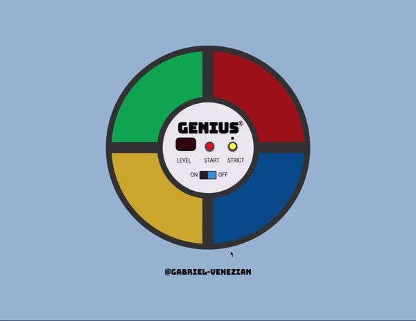

# Genius Game

Have you ever played Genius?

## About the game
Genius was a very popular toy in the 80's. With a shape similar to a UFO, it has colored controls that emit harmonic sounds and lit up in sequence. 
The game objective is to repeat the process without making any mistakes.

## Game difficulty
<b>Normal Mode:</b> Even if you make mistakes, the game will repeat the sequence until you pass it. 
<b>Strict Mode:</b> Play for as long as you can. When you make any mistake the game starts again with a new sequence.

## Acknowledgments
This game was developed with the help of [inkasadev](https://github.com/inkasadev) during the course "How to Make a JavaScript Responsive Game", available on [YouTube](https://www.youtube.com/watch?v=iPI-exnefBo&list=PL28O_hEAqjAtOPTlRHkHrhfmct_USCGfI).

## License
This project is licensed under the MIT License - see the [LICENSE.md](https://github.com/gabriel-venezian/genius-game/blob/main/LICENSE.md) file for details.
